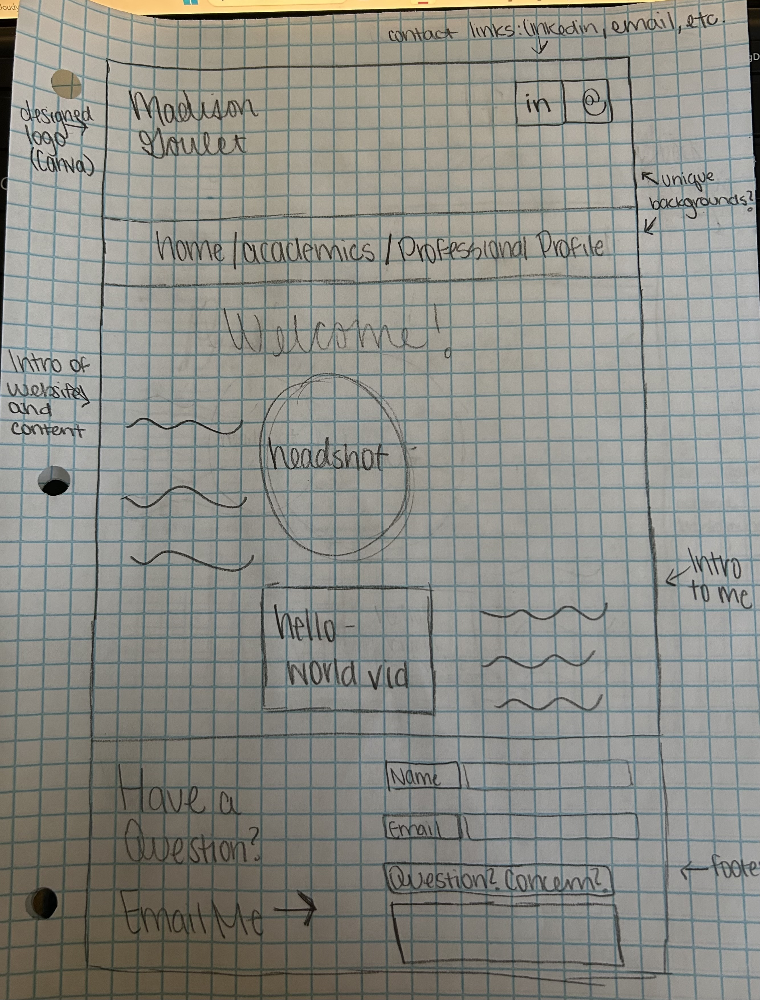
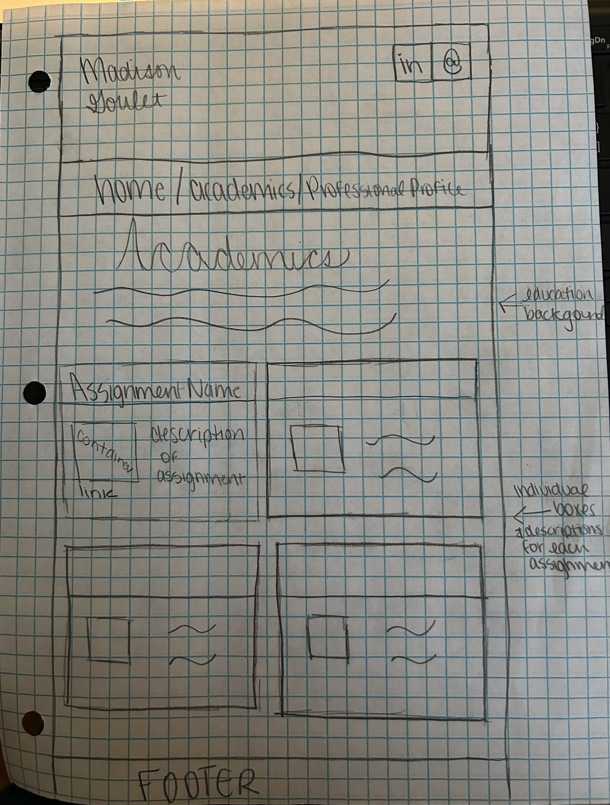
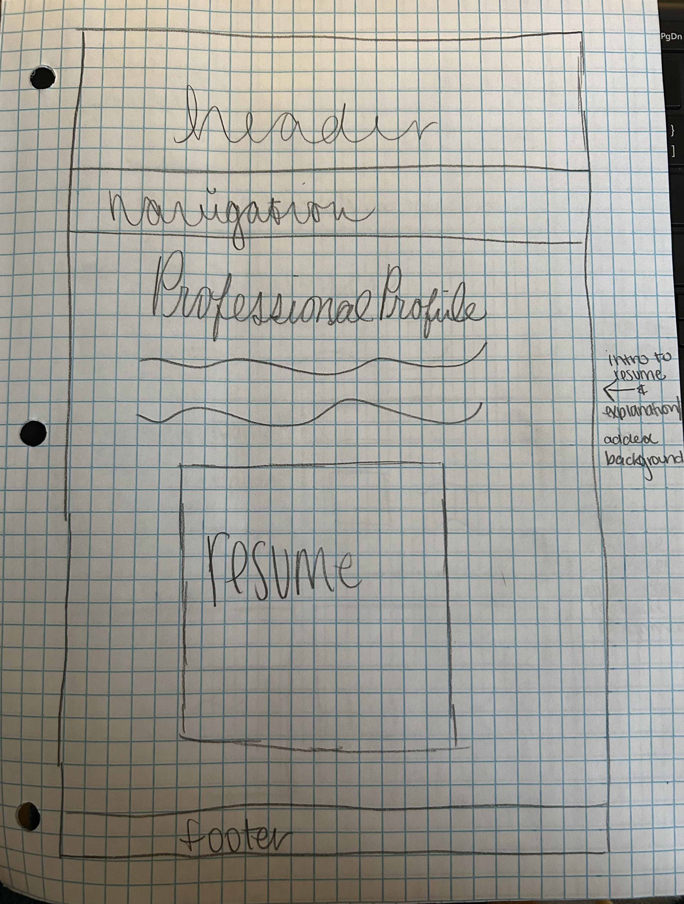

# Madison Goulet's INF 6420 Project

A personal website that introduces me personally, academically, and professionally. 

## Wireframes 

### Home Page
Here is a photo sketch of the home page for my website.

Header - will include a website logo of my name and contact links of LinkedIn, email, etc. 

Navigation Menu - will include the links to the other pages; home, academics, professional profile 

Main Content - will include an intro to the website and its content, a headshot photo, an intro to me personally, and the one-minute hello-world video 

Footer - will include an area to email me straight from the website page 

### Academics Page
Here is a photo sketch of the academics page for my website. 

Header - will include a website logo of my name and contact links of LinkedIn, email, etc

Navigation Menu - will include the links to the other pages; home, academics, professional profile 

Main Content - will include a brief introduction to my educational background and various assigments that display various skills 

Footer - will include an area to email me straight from the website page 

### Professional Profile Page 
Here is a photo sketch of the professional profile page for my website. 

Header - will include a website logo of my name and contact links of LinkedIn, email, etc

Navigation - will include the links to the other pages; home, academics, professional profile 

Main Content - will include an introduction to my professional background and my resume 

Footer - will include an area to email me straight from the website page 